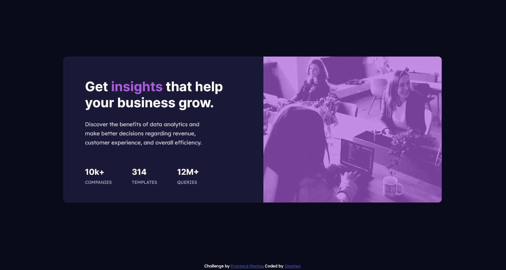

# Frontend Mentor - Stats preview card component solution

This is a solution to the [Stats preview card component challenge on Frontend Mentor](https://www.frontendmentor.io/challenges/stats-preview-card-component-8JqbgoU62). Frontend Mentor challenges help you improve your coding skills by building realistic projects. 

## Table of contents

- [Overview](#overview)
  - [The challenge](#the-challenge)
  - [Screenshot](#screenshot)
  - [Links](#links)
- [My process](#my-process)
  - [Built with](#built-with)
  - [What I learned](#what-i-learned)
  - [Continued development](#continued-development)
  - [Useful resources](#useful-resources)
- [Author](#author)

## Overview

### The challenge

The goal is to create a responsive component as close as possible with the design. Users are able to view this comonent using mobile or desktop, and the layout will be adjusted accordingly.

### Screenshot

### Links

- Solution URL: [solution page](https://github.com/Argetlahm/stats-preview-card-component/tree/master/my-app)
- Live Site URL: [live site](https://argetlahm.github.io/stats-preview-card-component/)

## My process

### Built with

- Semantic HTML5 markup
- CSS custom properties
- Flexbox
- Mobile-first workflow
- [React](https://reactjs.org/) - JS library
- [Next.js](https://nextjs.org/) - React framework

### What I learned

First time I tried to integrate a React development environment into the project. I use Create React App module for this project. I also learned how to modify and edit the CSS and use the public folder from within the project.

Finally, I also learn some new knowledge about how to host the React project on Github for simpple previewing.

### Continued development

Perhaps I will update this project in the future to modify some of the responsiveness issue that may be found in the future

### Useful resources

- [Create React App](https://create-react-app.dev/docs/getting-started/) - This helped me to learn how to build React app properly.
- [React-GH-Pages](https://github.com/gitname/react-gh-pages) - This is an amazing reository that provide step-by-step tutorial on how to deploy React app to Github.

## Author

- Github - [Stephen](https://github.com/Argetlahm)
- Frontend Mentor - [Argetlahm](https://www.frontendmentor.io/profile/Argetlahm)
